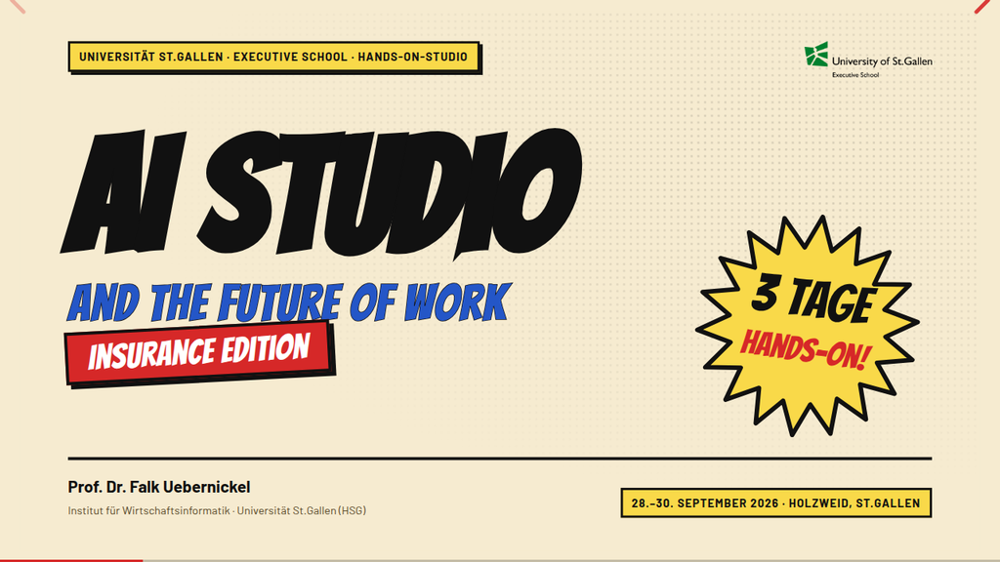

# AI Studio — Vorlagen-Foliensatz «Golden Age»

Foliensatz-Vorlage für **AI Studio and the Future of Work**, Executive School der Universität
St.Gallen. Comicstil auf hellem Gelb-Ocker, HSG-Logo oben rechts, dreizehn fertige Folientypen.



## Loslegen

```bash
git clone https://github.com/falkue/ai-studio-foliensatz
cd ai-studio-foliensatz
```

Dann `AI Studio — Vorlagen-Foliensatz v1.html` im Browser öffnen. Mehr braucht es nicht: reveal.js,
Schriften und Logo sind eingebettet, die Datei läuft offline und ohne Installation.

Für einen eigenen Foliensatz die Datei **kopieren** und in der Kopie arbeiten:

```bash
cp "AI Studio — Vorlagen-Foliensatz v1.html" "AI Studio — Tag 2.html"
```

Die Vorlage selbst bleibt unverändert, damit die nächste Person sauber starten kann.

## Mit Claude Code oder Codex arbeiten

Im geklonten Ordner das Werkzeug starten und einfach sagen, was auf die Folie soll:

```
claude
> Bau mir aus der Inhalts-Vorlage drei Folien über MCP: was es ist,
> wie ein Server angebunden wird, und woran man merkt, dass es klemmt.
> Schreib sie in "AI Studio — Tag 2.html".
```

Die [`CLAUDE.md`](CLAUDE.md) daneben erklärt dem Modell Raster, Farben, Bausteine und die
inhaltlichen Regeln. Codex und andere Agenten lesen sie ebenfalls, wenn man sie darauf hinweist:
«Halte dich an die CLAUDE.md in diesem Ordner.»

## Was drin ist

| Vorlage | Wofür |
|---|---|
| Titel | Deckblatt mit 3D-Titel, Edition-Balken und Kernzahl im Burst |
| Agenda · Drei Tage | Programm über mehrere Tage, ein Panel je Tag |
| Agenda · Tag | Run-of-Show mit Zeiten und Format-Tags |
| Kapitel | Trenner mit grosser Ziffer in Ben-Day-Punkten |
| Statement | Ein Satz, ganzseitig, sonst nichts |
| Inhalt | Der Standard: Kopf-Trio, drei Panels, Frage ans Publikum |
| Code | Quelltext mit Syntaxfarben, drei nummerierte Callouts |
| Screenshot | Bild über die volle Breite |
| Video | YouTube-Einbettung mit Beobachtungsfragen |
| Prompting | Prompt-Muster (Rolle · Ziel · Kontext · Ergebnis) |
| Fallstudie | Kontext zur Beispielfirma Pfefferminzia |
| Drill | Aufgabenblatt mit Rolle, Ergebnis und kopierfertigen Prompts |
| Schluss | Zum Mitnehmen, Ausblick, Kontakt |
| Vorstellung | Comicfigur des Dozenten stellt sich vor |
| Team | Drei Dozentenkarten, Figur oder Platzhalter |

Dazu die **Comicfigur** von Falk als Vektorgrafik in `assets/figur/` – vier Looks, sieben Posen,
frei skalierbar; wie man sie einsetzt, steht in der `CLAUDE.md`.

Die ersten beiden Folien der Datei sind Wegweiser (Anleitung und Übersicht) und fliegen aus dem
echten Foliensatz raus.

## Präsentieren

| | |
|---|---|
| Weiter / zurück | Pfeiltasten, Leertaste |
| Referentenansicht mit Notizen | **S** |
| Vollbild | **F** |
| Übersicht aller Folien | **ESC** |
| PDF | `?print-pdf` an die URL hängen, drucken, «Hintergrundgrafiken» anhaken |

## Die drei Regeln, die den Satz tragen

1. **Der Titel ist die Aussage der Folie**, nicht ihr Thema — ein ganzer Satz, einzeilig.
   Liest man alle Titel nacheinander, versteht man den Vortrag.
2. **Eine Aussage pro Folie.** Was sie nicht trägt, fliegt raus.
3. **Passt der Text nicht, wird die Folie geteilt** — nie die Schrift verkleinert.
   Fliesstext bleibt bei mindestens 19 px, nichts auf der Folie geht unter 15 px.

## Beispielfirma

Der Kurs arbeitet mit **Pfefferminzia**, einem frei erfundenen Versicherer.
Datensatz: [github.com/falkue/Pfefferminzia](https://github.com/falkue/Pfefferminzia), Zweig
`teilnehmer`. Folien über die Fallstudie tragen einen Mint-Streifen am linken Rand. Ein Logo für
Pfefferminzia gibt es noch nicht — dort steht bis auf Weiteres ein Platzhalter.

## Rechte

Struktur aus dem Foliensatz «Synthetic Personas» (FHNW E-Commerce Day 2026), Aussehen neu für das
AI Studio entworfen. reveal.js 5.2.0 (MIT). Schriften Bangers, Barlow und JetBrains Mono
(SIL Open Font License 1.1), eingebettet. Das Logo der Universität St.Gallen ist deren Marke und
nur für Veranstaltungen der Universität zu verwenden.

Kontakt: Falk Uebernickel, falk.uebernickel@unisg.ch
